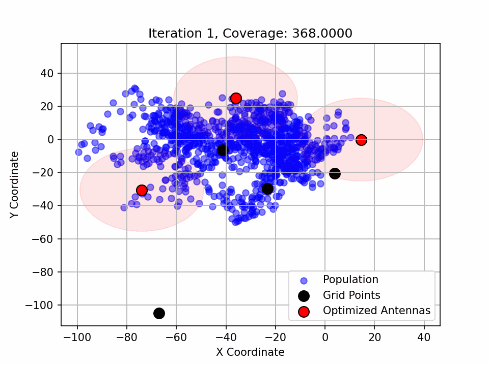

# CMC Workshop and Hackathon on NAQC
**Team Name:** RubiQ

**Team Members:**
- Colin Dietrich
- Isaac Donchi
- Lydia Molla
- Manimugdha Saikia
- Esraa Sobhy

 Iteration Evolution for the city Brandonberg 

---

## Introduction

In this project, we’re tackling the challenge of finding the best antenna placement across 10 cities to maximize coverage while avoiding overlap between antennas. For each city, we have data on the population distribution and a coverage radius \( R \) for each antenna. The goal is to maximize the number of people reached without allowing antennas to cover the same area.

| Name                | Coverage | Antennas |
|---------------------|----------|----------|
| Bradleymouth        | 873      | 6        |
| Brandonberg         | 909      | 3        |
| Hansenchester       | 874      | 5        |
| Joshuachester       | 748      | 4        |
| New Rebeccaberg     | 828      | 5        |
| North Cal           | 900      | 3        |
| Nort Christopherbuty| 864      | 6        |
| North Joshua        | 712      | 3        |
| Port Jonathan       | 831      | 5        |
| Zacharyburgh        | 827      | 4        |
| **Total**           | **8366** | **44**   |
| **Average**         | **836.6**| **4.4**  |

## Our Approach

We’re treating this as a graph optimization problem. We create an undirected graph where each possible antenna position is a vertex, and an edge connects any two antennas that overlap. Each vertex has a weight based on its coverage potential. The challenge is to find the **Maximum Weighted Independent Set (MWIS)**—essentially, the set of antennas that maximizes coverage without overlapping.

This is where things get tricky. Finding the MWIS in a large graph is computationally intense. So, we turned to **Neutral Atom Quantum Computing (NAQC)** to speed things up. The Rydberg blockade in NAQC naturally aligns with the independent set constraint in our problem, letting us use quantum physics to simplify the search for MWIS. In this repo, you’ll find an algorithm that uses an NAQC simulator to solve the MWIS problem, with classical methods before and after for setup and analysis.

Along the way, we tested several approaches:

- **Classical Solver (GLPK)**: Used `GLPK` in the `pulp` package to get an idea of the optimal MIS for a graph.
- **QUBO Reformulation**: We reformulated the problem as a QUBO (Quadratic Unconstrained Binary Optimization) problem, making it easier to map onto the NAQC register.
- **Pulse Optimization**: To align the system's Hamiltonian with our cost function, we optimized pulse parameters based on [this paper](https://arxiv.org/abs/2202.09372). 
- **Detuning Map Channel**: We tested applying a detuning map where each qubit’s detuning is proportional to the population it covers. Although this didn't improve results, we documented it as part of the process.

## Final Solution

Our final approach combines simulated annealing with NAQC’s strength in finding independent sets. Starting from a random grid layout, simulated annealing generates new layouts at each iteration. The NAQC then calculates the MIS for each layout, accelerating what would normally be a slow process. We continue this loop until reaching a target or max number of iterations.

---

## Repository Structure

The repository includes folders for data and figures, and several notebooks detailing our work:

- **`data/`**: Contains population distribution data for each city.
- **`figures/`**: Holds `.png` files for each city, showing population scatter plots and optimized antenna placements (with coverage circles). Also includes coverage evolution graphs for each iteration in simulated annealing.
- **`media/`**: Contains
    - `Hackathon_logistics.pdf`
    - `iteration_evolution_{city_name}.gif`: Displays the progression of antenna placements over iterations for each city.
    - `optimized_values.npz`: Stores optimized pulse parameters for computing the MIS.

### Jupyter Notebook Files

- **`classical_linear_solver.ipynb`**: Classical solution using the GLPK solver from `pulp`.
- **`pulse_optimization.ipynb`**: Implements the pulse optimization approach from [this paper](https://arxiv.org/abs/2202.09372). Saves optimized pulse parameters in `optimized_values.npz`.
- **`main_algorithm.ipynb`**: Contains our **main solution**, detailing the final approach. This notebook generates files in the `figures` folder and the `.gif` in `media`.
- **`second_algorithm.ipynb`**: Generate a fixed grid using a greedy algorithm. Then using a detuning map and the rydberg chanel, we optimize the parameters to generate the MWIS of the given grid.
